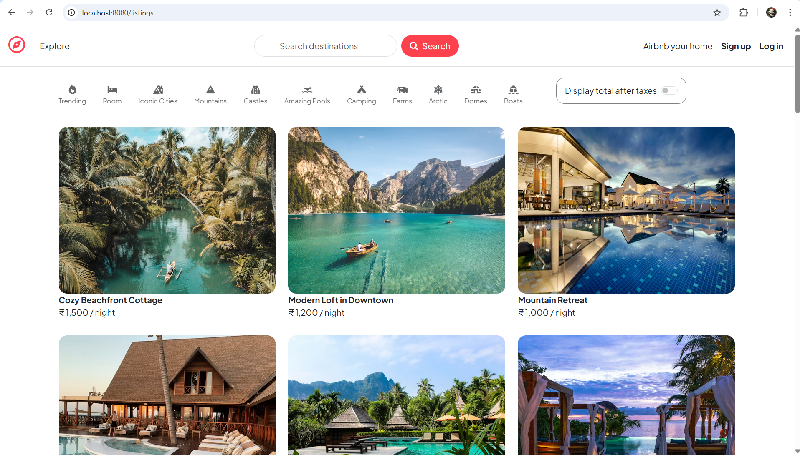
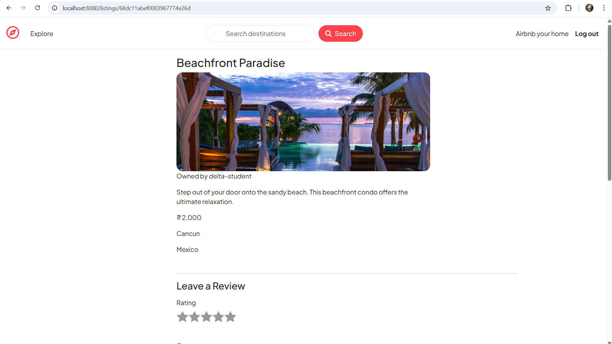
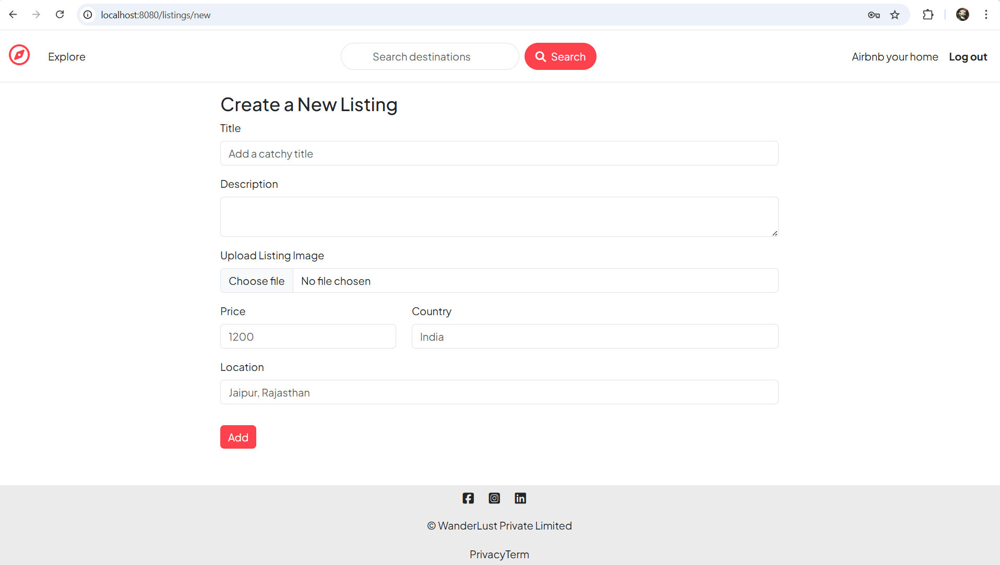
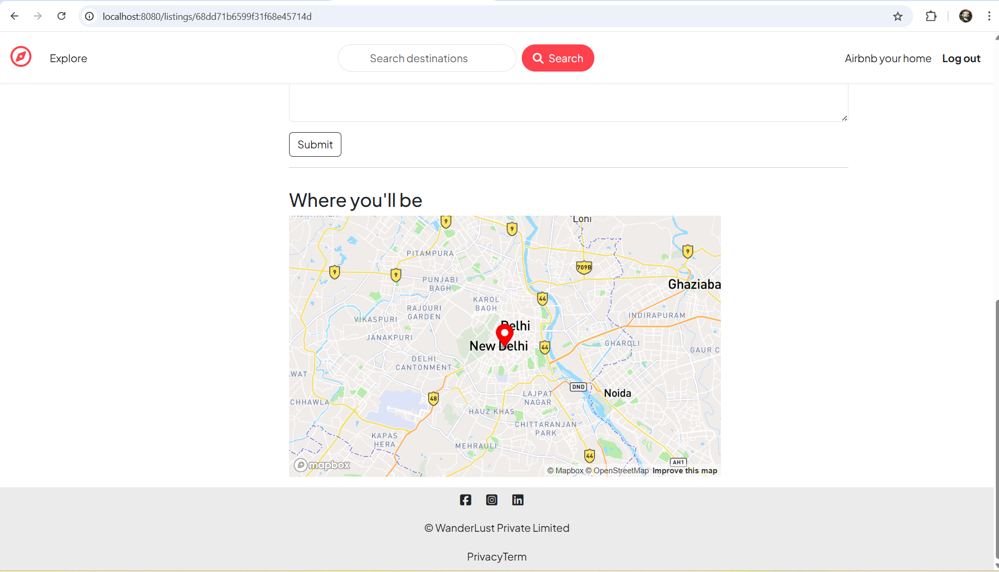
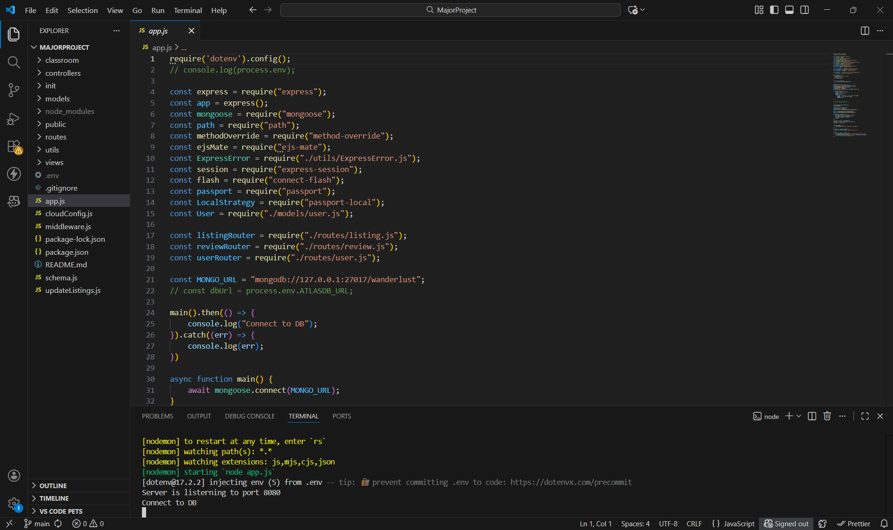

# WonderStay – Travel & Stay Booking Website

WonderStay is a full-stack travel website inspired by Airbnb, developed using Node.js, Express.js, MongoDB, and MVC architecture. The platform allows users to explore, create, and manage property listings with interactive location mapping and secure backend operations.

---

## Project Overview
WonderStay is designed to simulate a real-world travel and accommodation platform. It provides users with the ability to browse travel listings, view property locations on maps, and perform CRUD operations securely. The application follows MVC architecture for clean code organization and scalability.

---

## Key Features
- Full-stack travel website inspired by Airbnb
- Create, read, update, and delete (CRUD) property listings
- Secure server-side validation and error handling
- Interactive maps for property locations using Mapbox API
- Responsive frontend design for different screen sizes
- Centralized application logic written in JavaScript

---

## Tech Stack
- **Node.js** – Backend runtime environment  
- **Express.js** – Web application framework  
- **MongoDB** – NoSQL database for storing listings and data  
- **Mongoose** – Object Data Modeling (ODM)  
- **JavaScript** – Application logic (frontend & backend)  
- **HTML & CSS** – Responsive UI design  
- **Mapbox API** – Interactive maps for listing locations  

---

## 📸 Screenshots

### Home / Listings Page

### Listing Details

### Create New Listing

### Mapbox Location View

### Backend & Server Setup

---

## Technical Implementation
- MVC (Model–View–Controller) architecture for structured codebase
- Secure CRUD operations with server-side validation
- Centralized error handling using middleware
- RESTful routing for application endpoints
- Mapbox API integration for dynamic location visualization
- Clean separation of frontend views and backend logic

---

## How to Run Locally
1. Clone the repository
   git clone https://github.com/adityadahake25/WanderStay.git

2. Go to the project folder
   cd WanderStay

3. Install dependencies
   npm install

4. Create a `.env` file and add required environment variables

5. Start the server
   npm start

6. Open browser and visit
   http://localhost:8080/listings

---
